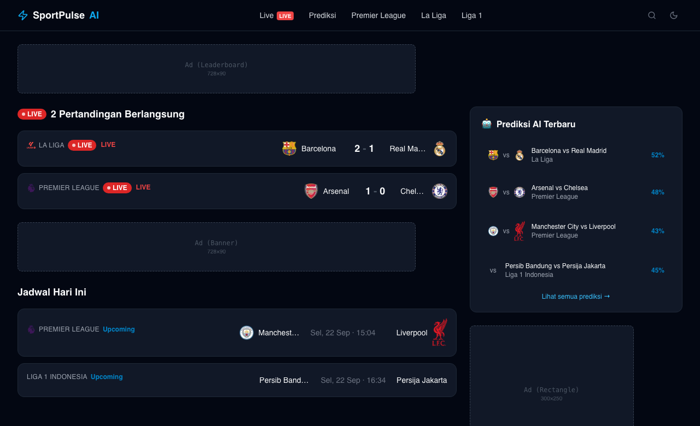

# SportPulse AI

Live football scores, AI-generated predictions, and match insights.



## Stack

- **apps/web** — Next.js 14 (App Router, TypeScript, TailwindCSS)
- **apps/api** — NestJS (Fastify adapter, TypeScript)
- **packages/** — shared types, utilities, and UI components

## Getting Started

```bash
npm install
bash scripts/setup.sh
cp .env.example .env   # fill in API keys (see below)
npm run dev             # runs web + api via Turborepo
```

- Frontend: http://localhost:3000
- API: http://localhost:3001 (docs at `/docs`)

Required environment variables (`.env`):

- `API_FOOTBALL_KEY` — live match data (api-football.com)
- `OPENAI_API_KEY` — AI summaries and predictions
- `ONESIGNAL_APP_ID` / `ONESIGNAL_REST_API_KEY` — push notifications
- `GOOGLE_CLIENT_ID` / `GOOGLE_CLIENT_SECRET` — Google OAuth
- `NEXT_PUBLIC_GOOGLE_ADSENSE_ID` — Google AdSense
